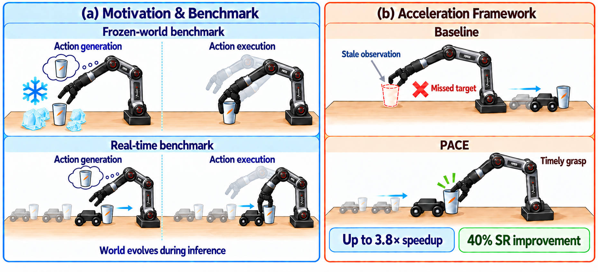
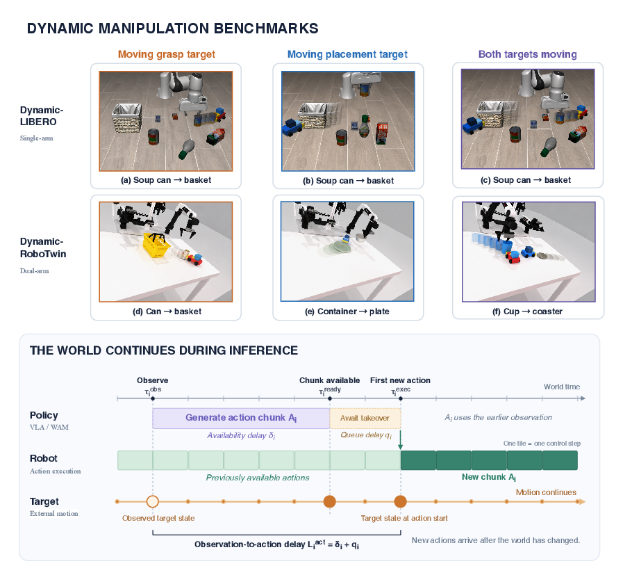
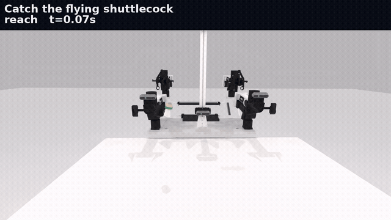
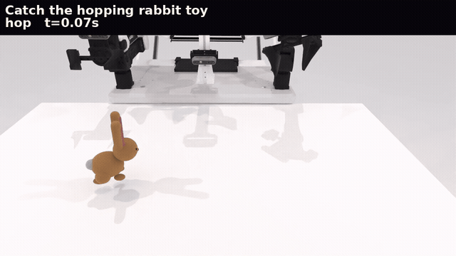
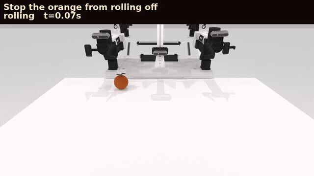
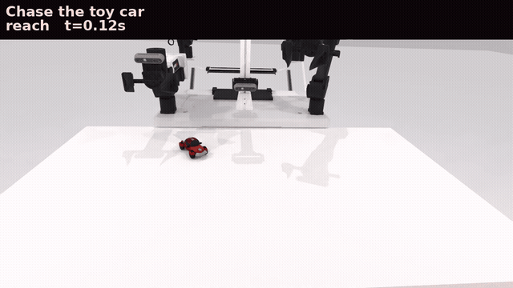
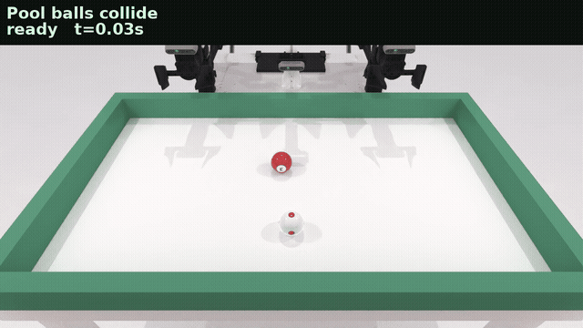
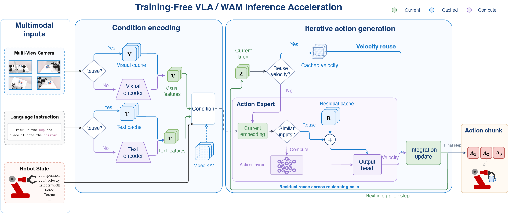
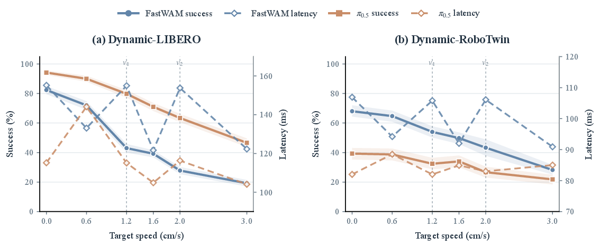
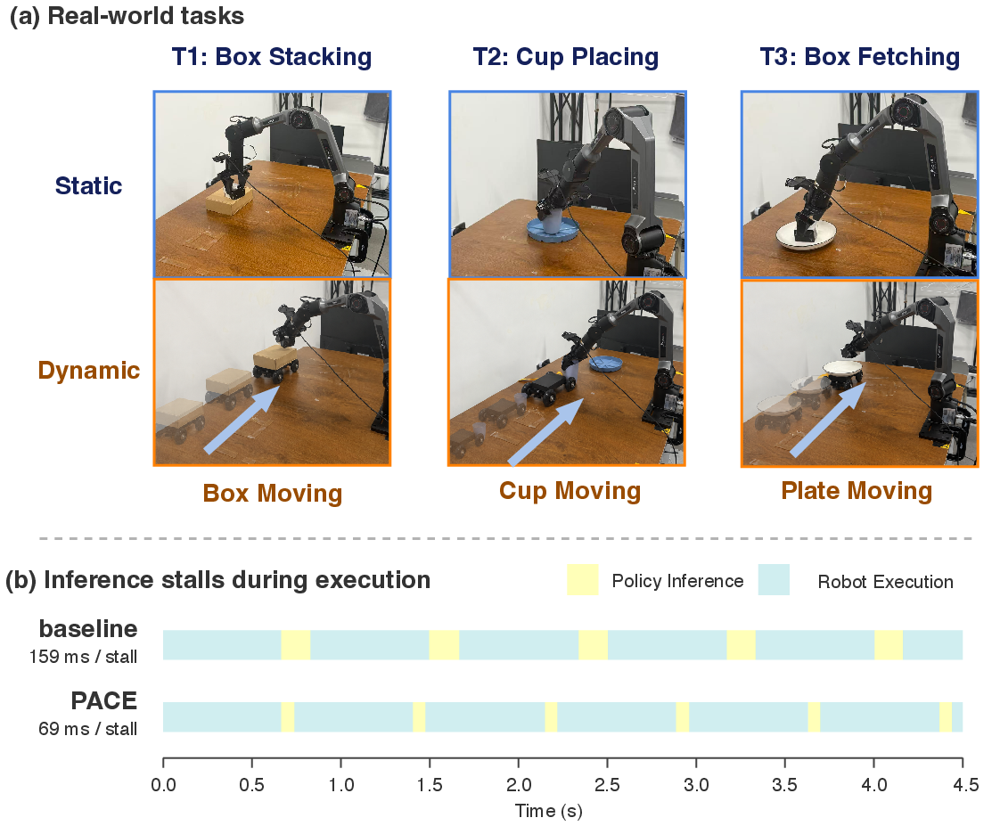

# Official Implementation of The World Does Not Pause

**The World Does Not Pause: Real-Time Benchmarks and Training-Free Acceleration for Dynamic Manipulation**

[](LICENSE)

Dynamic manipulation needs actions that are still right when they arrive. This repository is the official implementation of **Dynamic-LIBERO**, **Dynamic-RoboTwin**, and **PACE** (Policy Acceleration through Cached Execution), a training-free runtime for FastWAM and π₀.₅.

<p align="center">
  
</p>

<p align="center">
  <em>
  (a) A frozen world hides the delay; the real-time benchmark keeps the target moving during inference.
  (b) PACE reaches the moving target, with up to 3.8× speedup and a 40% success improvement.
  </em>
</p>

---

## Overview

Vision-language-action models and world action models can leave an action conditioned on an observation that is already out of date. Dynamic-LIBERO and Dynamic-RoboTwin keep the original task goals and add controlled target motion together with inference-time world evolution, so a frozen policy can be evaluated under that delay.

PACE reuses observation representations and action computation across replanning calls and integration steps. Weights stay fixed.

Across the two benchmarks and two policies, PACE speeds inference by up to 3.8× and raises dynamic success by up to 42.8 percentage points over the standard deployment, with the highest success in all eight dynamic settings. On a physical robot it cuts per-chunk inference stalls from 159 ms to 69 ms.

---

## Benchmarks

| Benchmark | Tasks | Setting |
|---|---:|---|
| Dynamic-LIBERO | 50 | single-arm LIBERO skills; pick, place, and both, including curved paths |
| Dynamic-RoboTwin | 45 | dual-arm RoboTwin skills; pick, place, and both |
| Extra appendix | 5 | intercept, chase, and a physics demo; not part of the 95 |

The shared protocol is `real_time_v2`: the world keeps moving while the policy thinks, and success uses the original checker.

<p align="center">
  
</p>

<p align="center">
  <em>Task examples and the observation-to-action delay.</em>
</p>

## Extra demos

Five Dynamic-RoboTwin appendix tasks. They use the same real-time protocol and stay outside the 95-task table. Click a clip for the full video.

<p align="center">
  <a href="assets/extra/catch_shuttlecock.mp4"></a>
  <br><em>Catch the flying shuttlecock.</em>
</p>

<p align="center">
  <a href="assets/extra/catch_bunny.mp4"></a>
  <br><em>Catch the hopping bunny toy.</em>
</p>

<p align="center">
  <a href="assets/extra/stop_rolling_orange.mp4"></a>
  <br><em>Stop the orange from rolling off.</em>
</p>

<p align="center">
  <a href="assets/extra/pursue_toycar.mp4"></a>
  <br><em>Pursue the toy car.</em>
</p>

<p align="center">
  <a href="assets/extra/collide_pool_balls.mp4"></a>
  <br><em>Collide the pool balls.</em>
</p>

---

## PACE

PACE places change-gated shortcuts on the inference path. Visual and text reuse skip repeated encoding. Residual reuse skips action layers and keeps the output head. Velocity reuse skips both. Every branch still advances the integration step.

| Policy | Preset | What it turns on |
|---|---|---|
| FastWAM | `accel=pace` (`ours` is the same preset) | `text_cache` + `step_cache` |
| FastWAM | `accel=baseline` (CLI `off`) | reference path |
| π₀.₅ | `pace` (`ours`, `fasterpi`) | `chunk_residual_cache` + `step_cache` |
| π₀.₅ | `baseline` | eager Euler |

`text_cache` keeps the instruction representation. `step_cache` reuses velocity inside a chunk. `chunk_residual_cache` reuses the cross-replan residual. Older π₀.₅ tokens `c3` and `d1` still resolve to `chunk_residual_cache` and `step_cache`.

<p align="center">
  
</p>

<p align="center">
  <em>Green is the current quantity, blue is cached, purple is computation.</em>
</p>

---

## Results

<p align="center">
  
</p>

<p align="center">
  <em>Solid lines are task success. Dashed lines are mean model latency. Bands are 95% task-stratified bootstrap intervals.</em>
</p>

<p align="center">
  
</p>

<p align="center">
  <em>(a) Static and dynamic variants of box stacking, cup placing, and box fetching. (b) PACE shortens each inference stall from 159 ms to 69 ms.</em>
</p>

---

## Installation

```bash
git clone https://github.com/RuoxiangHuang/TheWorldDoesNotPause.git
cd TheWorldDoesNotPause
export PYTHONPATH="$PWD/FastWAM/src:$PWD/Benchmarks:$PWD/pi05"
export MUJOCO_GL=egl
```

```text
TheWorldDoesNotPause/
├── FastWAM/          # fasterwam, preset accel=pace
├── pi05/             # fasterpi, preset pace
└── Benchmarks/
    └── benchmarks/
        ├── official_tasks.py
        ├── dynamic_libero/
        └── dynamic_robotwin/
```

`Benchmarks/` is the directory name the eval entrypoints use to find `bootstrap_paths.py`. The benchmark packages are `benchmarks.dynamic_libero` and `benchmarks.dynamic_robotwin`.

---

## Evaluation

Point `--checkpoint` at the matching FastWAM or π₀.₅ checkpoint. Paired comparisons use one checkpoint and vary only the preset (`off` versus `pace`).

```bash
python -m pytest FastWAM/tests/test_configs.py -q
python -m pytest Benchmarks/benchmarks/dynamic_libero/tests/test_trajectories.py -q

python -m benchmarks.dynamic_libero.eval.run_official \
  --checkpoint "$CKPT" --mode sr \
  --task-suite libero_object --task-ids 0 --dry-run

python -m benchmarks.dynamic_robotwin.eval.run_official \
  --checkpoint "$CKPT" --mode sr \
  --task-names place_empty_cup --dry-run
```

The five appendix tasks are `--task-names extra` under Dynamic-RoboTwin. They are not mixed into the 95-task table.

---

## Citation

```bibtex
@inproceedings{worlddoesnotpause2026,
  title={The World Does Not Pause: Real-Time Benchmarks and Training-Free Acceleration for Dynamic Manipulation},
  year={2026}
}
```

---

## License

This project is licensed under the [MIT License](LICENSE).
